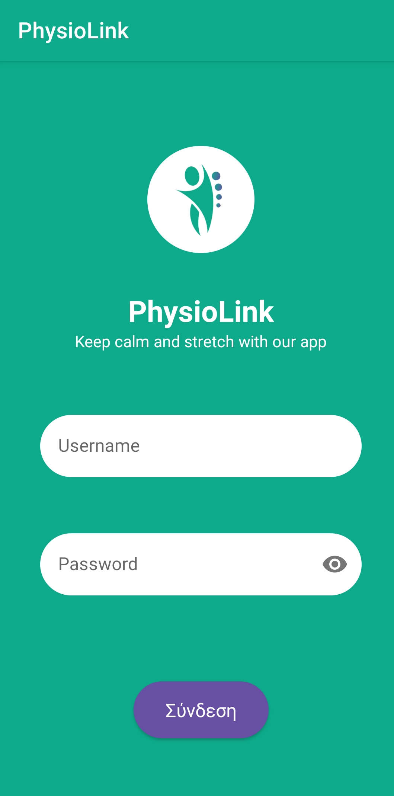
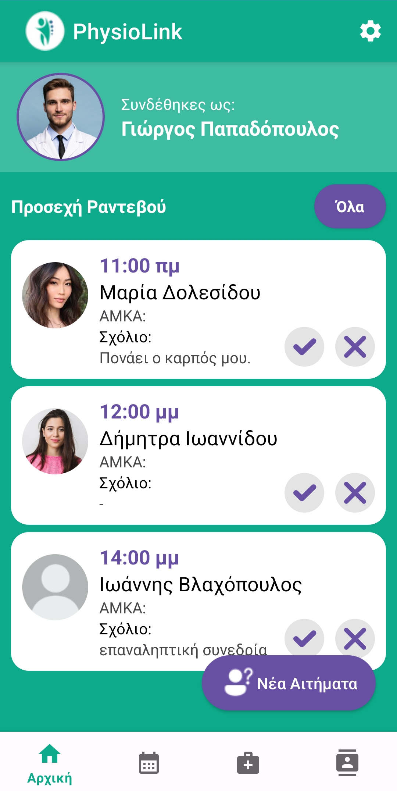
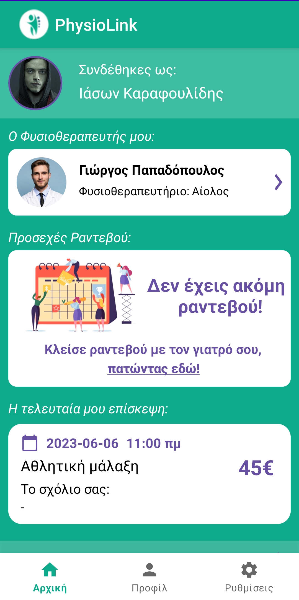
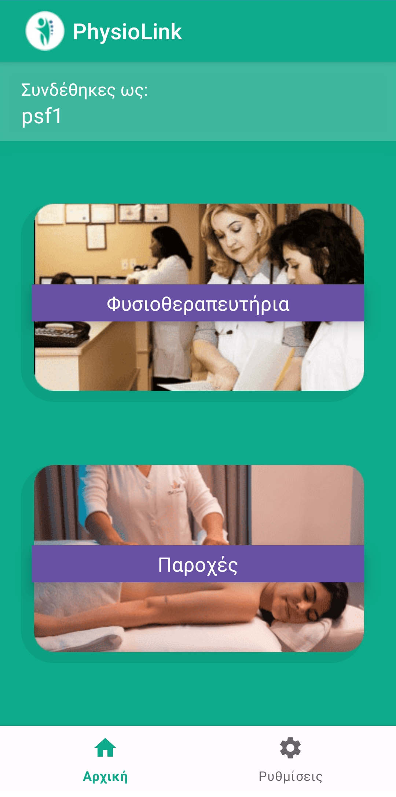

# PhysioLink
This project was developed as part of the Development of Android Applications Course, University of Macedonia.

    
    
    
    

### Team members (Team 11)
<ul>
    <li><b>Kote Kostandin</b></li>
    <li><b>Theodora Katseisvili</b></li>
    <li><b>Vicky Limenidou</b></li>
    <li><b>Charisiadis Aristotelis</b></li>
    <li><b>Panagiotis Stergioulas-Bolis</b></li>
    <li><b>Koudouni Alexandra</b></li>
    <li><b>Shenepremte Eleni</b></li>
    <li><b>Sophocles Panteris</b></li>
    <li><b>Iason Karafoulidis</b></li>
    <li><b>Christos Tsarchopoulos</b></li>
</ul>

### 

### Requirements
<ul>
    <li>Android Studio</li>
    <li>Minimum API level 26</li>
    <li>The app is responsive in all models, but models like Nexus 5X provide an optimal experience</li>
    <li>The server is live and there is no setup needed. However, you can setup the server locally if you want as described in the <a href="https://github.com/setokk/PhysioLink-Backend#running-the-app">PhysioLink-Backend</a> repository</li>
</ul>

